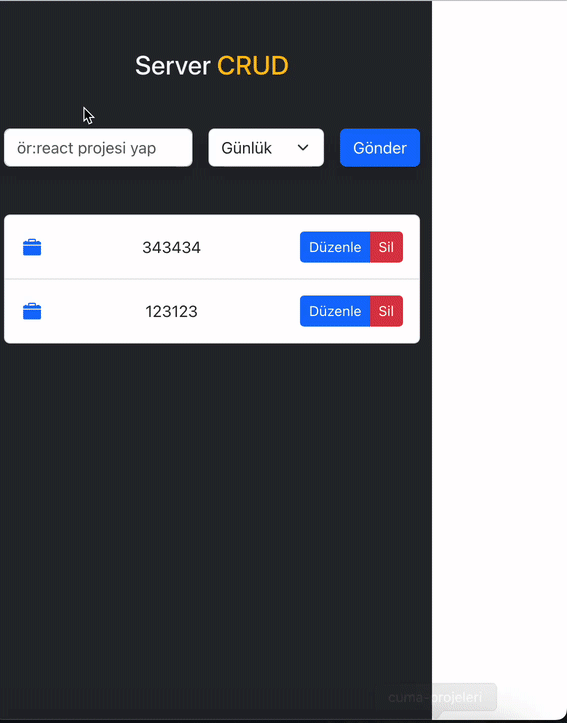

# ✅ React Todo App

This is a **React-based Todo application** with features like creating, reading, updating, and deleting tasks. The app uses **JSON Server** for API endpoints and **Axios** for handling API requests. It includes a user-friendly interface with modals, toast notifications, and icons for better usability.

## ✨ Features
- **CRUD Operations**: Create, Read, Update, and Delete tasks with API integration.
- **API Integration**: Fetches data from a JSON Server backend.
- **State Management**: Ensures state is updated dynamically after CRUD operations.
- **Modal for Editing**: Smooth and intuitive modals for editing tasks.
- **Toast Notifications**: Feedback for user actions using **React Toastify**.
- **Responsive Design**: Works seamlessly on all screen sizes.

## 🛠️ Technologies Used
- **React**: Component-based frontend framework.
- **Axios**: For making HTTP requests.
- **JSON Server**: Mock backend for API endpoints.
- **React Toastify**: Toast notifications for user actions.
- **React Icons**: For beautiful and lightweight icons.

# react-crud
